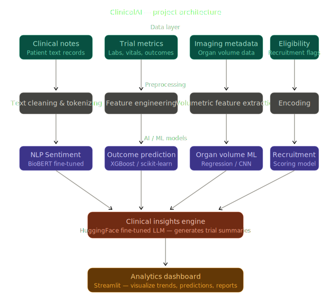
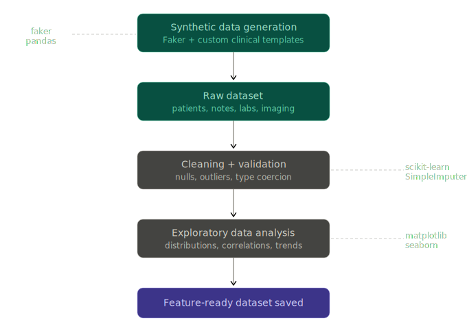

# ClinicalAI — Medpace-Inspired Clinical Trial Analytics Platform

An end-to-end AI/ML pipeline for accelerating clinical trials, inspired by
**Medpace IntelliPACE** and **MCL (Medical Core Lab)**. Built on the
**MIMIC-III-10k** dataset from Kaggle — 10,000 real ICU patients from
Beth Israel Deaconess Medical Center.

---

## Project overview

| Phase | Module | What it does |
|-------|--------|-------------|
| 1 | Data Pipeline | Load, clean, and engineer features from all 5 MIMIC-III tables |
| 2 | NLP (DistilBERT) | Classify clinical note severity — stable / moderate / critical |
| 3 | ML (XGBoost) | Predict in-hospital mortality with SHAP explanations |
| 4 | Organ Volumes | Predict liver, kidney, spleen volume changes (MCL simulation) |
| 5 | LLM (T5) | Auto-generate plain-English clinical trial progress reports |
| 6 | Dashboard | Interactive Streamlit analytics app across all phase outputs |

### System architecture



---

## Project structure

```
ClinicalAI/
│
├── README.md
├── requirements.txt
├── .env                          ← copy from .env.template and fill in
├── .env.template
├── .gitignore
│
├── documentation_images/         ← architecture & pipeline diagrams for README
│   ├── clinicalai_project_architecture.svg
│   ├── phase1_data_pipeline_flow.svg
│   ├── phase2_nlp_pipeline_Flow.svg
│   ├── phase3_ml_pipeline.svg
│   └── accuracy_improvement_roadmap.svg
│
├── data/
│   ├── raw/                      ← MIMIC-III-10k CSVs from Kaggle (gitignored)
│   │   ├── PATIENTS_sorted.csv
│   │   ├── ADMISSIONS_sorted.csv
│   │   ├── LABEVENTS_sorted.csv
│   │   ├── NOTEEVENTS_sorted.csv
│   │   └── DIAGNOSES_ICD_sorted.csv
│   └── processed/                ← pipeline outputs (auto-generated)
│       ├── mimic_master_features.csv
│       ├── mimic_notes_nlp.csv
│       ├── training_pairs.csv
│       ├── ml_features_train.csv
│       ├── ml_features_val.csv
│       ├── ml_features_test.csv
│       ├── ml_predictions.csv
│       ├── nlp_predictions.csv
│       ├── organ_volume_predictions.csv
│       └── clinical_reports.csv
│
├── models/                       ← saved models (auto-generated, gitignored)
│   ├── distilbert_finetuned/
│   ├── summarizer_model/
│   ├── xgboost_model.pkl
│   ├── volume_models.pkl
│   ├── imputer.pkl
│   ├── scaler.pkl
│   └── shap_importance.csv
│
├── phase1_data_pipeline/
│   ├── data_pipeline.py
│   └── outputs/
│       └── phase1_eda_mimic.png
│
├── phase2_nlp/
│   ├── nlp_pipeline.py
│   ├── train_biobert.py
│   ├── evaluate_nlp.py
│   └── outputs/
│       ├── phase2_nlp_report.png
│       └── classification_report.txt
│
├── phase3_ml/
│   ├── feature_engineering.py
│   ├── outcome_model.py
│   ├── evaluate_ml.py
│   └── outputs/
│       ├── phase3_ml_report.png
│       └── classification_report.txt
│
├── phase4_imaging/
│   ├── volume_predictor.py
│   └── outputs/
│       └── phase4_volume_report.png
│
├── phase5_llm/
│   ├── insights_generator.py
│   └── phase5_llm/outputs/
│       ├── clinical_reports.csv
│       └── sample_reports/
│           ├── high_mortality_risk.txt
│           └── longest_los.txt
│
└── phase6_dashboard/
    ├── app.py
    ├── components/
    │   └── data_loader.py
    └── pages/
        ├── 01_patient_overview.py
        ├── 02_nlp_insights.py
        ├── 03_outcome_prediction.py
        ├── 04_organ_volumes.py
        └── 05_trial_reports.py
```

---

## Setup

### 1. Clone and create virtual environment

```bash
git clone <your-repo-url>
cd ClinicalAI
python -m venv venv
source venv/bin/activate        # Linux / macOS
venv\Scripts\activate           # Windows
```

### 2. Install dependencies

```bash
pip install -r requirements.txt
```

> **PyTorch note:** `requirements.txt` installs the CPU build by default.
> For CUDA (NVIDIA GPU) training run this instead:
> ```bash
> pip install torch==2.10.0 --index-url https://download.pytorch.org/whl/cu121
> ```

### 3. Download MIMIC-III-10k from Kaggle

1. Go to [https://www.kaggle.com/datasets/drscarlat/mimic-iii-10k](https://www.kaggle.com/datasets/drscarlat/mimic-iii-10k)
2. Download and unzip into `data/raw/`
3. The files should be named with `_sorted` suffix:
   `PATIENTS_sorted.csv`, `ADMISSIONS_sorted.csv`, etc.

### 4. Configure `.env`

```bash
cp .env.template .env
```

Edit `.env`:

```env
DATA_DIR=data/raw
PROCESSED_DIR=data/processed
MODEL_DIR=models
HF_MODEL_NAME=distilbert-base-uncased
HF_SUMM_MODEL=facebook/bart-large-cnn
MLFLOW_TRACKING_URI=mlruns
```

---

## Running the pipeline

Run each phase in order from the **project root** (`ClinicalAI/`):

### Phase 1 — Data pipeline

```bash
python phase1_data_pipeline/data_pipeline.py
```

Loads all 5 MIMIC-III tables, computes age at admission (with MIMIC's
de-identified DOB overflow fix), engineers features, runs EDA, and saves:
- `data/processed/mimic_master_features.csv` → input to Phases 3, 4, 5
- `data/processed/mimic_notes_nlp.csv` → input to Phase 2



Runtime: ~30 seconds

---

### Phase 2 — NLP severity classification

```bash
python phase2_nlp/train_biobert.py    # fine-tune + save model + predictions
python phase2_nlp/evaluate_nlp.py     # generate charts and classification report
```

Fine-tunes `distilbert-base-uncased` on a stratified 20k sample of 480k
MIMIC clinical notes. Labels: `stable / moderate / critical` (keyword-derived).
Uses lazy tokenization (no upfront RAM spike), class-weighted loss, and
early stopping on macro-F1.


Key settings (in `nlp_pipeline.py`):
```python
SAMPLE_SIZE  = 20_000   # set None for full 480k (overnight run)
MAX_LEN      = 256      # increase from 128 for better accuracy
HF_MODEL_NAME = "distilbert-base-uncased"  # or "emilyalsentzer/Bio_ClinicalBERT"
```

Runtime: ~5–8 min on GTX 1650 | ~45 min on CPU
Expected accuracy: ~79–85%

Saves:
- `models/distilbert_finetuned/`
- `data/processed/nlp_predictions.csv`

---

### Phase 3 — Outcome prediction (XGBoost)

```bash
python phase3_ml/feature_engineering.py   # impute, SMOTE, scale, save splits
python phase3_ml/outcome_model.py          # hyperparameter search + train + SHAP
python phase3_ml/evaluate_ml.py            # ROC, confusion matrix, feature importance
```

Predicts in-hospital mortality (`DIED=1`) from tabular features + NLP severity
scores. Engineers 5 clinical domain features (liver score, renal score,
hematologic score, high-risk flag, age group). Uses SMOTE for class imbalance
and `RandomizedSearchCV` (30 iterations, 5-fold CV) for hyperparameter tuning.



Optional SHAP explanations:
```bash
pip install shap==0.47.2
```

Runtime: ~2–5 min
Expected ROC-AUC: 0.87–0.92

Saves:
- `models/xgboost_model.pkl`
- `models/shap_importance.csv`
- `data/processed/ml_predictions.csv`

---

### Phase 4 — Organ volume prediction (MCL simulation)

```bash
python phase4_imaging/volume_predictor.py
```

Simulates Medpace MCL organ volumetrics. Predicts liver, kidney, and spleen
volume change (%) using lab proxies (ALT → liver, creatinine → kidney,
platelet count → spleen), ICD-9 disease category, and NLP severity.
Extracts radiology report organ mentions from NOTEEVENTS in 50k-row chunks.

Expected R²: liver ~0.85 | kidney ~0.80 | spleen ~0.32

Runtime: ~15–20 sec (after Phase 1 radiology extraction ~15 sec)

Saves:
- `models/volume_models.pkl`
- `data/processed/organ_volume_predictions.csv`

---

### Phase 5 — Clinical insights LLM

```bash
python phase5_llm/insights_generator.py
```

Merges all phase outputs and fine-tunes a `t5-small` summarization model
to generate plain-English clinical trial progress reports — simulating
Medpace IntelliPACE report generation.

Model auto-selection by VRAM:
- GTX 1650 (< 5GB) → `t5-small` (60MB, gradient checkpointing enabled)
- 5–8GB GPU → `t5-base`
- ≥ 8GB GPU → `facebook/bart-large-cnn`
- No GPU → template-based reports (no fine-tuning)

Runtime: ~20–30 min on GTX 1650 | ~5 min on larger GPU

Saves:
- `models/summarizer_model/`
- `phase5_llm/phase5_llm/outputs/clinical_reports.csv`
- `phase5_llm/phase5_llm/outputs/sample_reports/`

---

### Phase 6 — Streamlit dashboard

```bash
# Always run from project root ClinicalAI/
streamlit run phase6_dashboard/app.py
```

Opens at `http://localhost:8501`

| Page | Content |
|------|---------|
| Patient Overview | Demographics, LOS, mortality by admission type, ICD-9 categories |
| NLP Insights | Severity distribution, per-note-type breakdown, mortality vs severity, note viewer |
| Outcome Prediction | ROC curve, confusion matrix, SHAP importance, risk stratification table |
| Organ Volumes | Volume distributions, change by disease category, scatter vs LOS and age |
| Trial Reports | Filterable paginated AI-generated reports with risk-tier colour coding |

---

## Dataset

**MIMIC-III-10k** — a 10,000-patient subset of the MIMIC-III Clinical Database
(Beth Israel Deaconess Medical Center, PhysioNet).

| Table | Rows | Description |
|-------|------|-------------|
| PATIENTS | 10,000 | Demographics, DOB, mortality flag |
| ADMISSIONS | 12,911 | Hospital stays, diagnosis, insurance |
| LABEVENTS | 6,612,626 | Lab results across 677 ITEMIDs |
| NOTEEVENTS | 482,770 | Clinical free-text notes (15 categories) |
| DIAGNOSES_ICD | 118,300 | ICD-9 codes (4,252 unique) |

> MIMIC dates are shifted per-patient for de-identification. Ages >89 are
> masked as ~300 years — the pipeline handles this with a safe year-based
> age calculation.

---

## Hardware requirements

| Component | Minimum | Recommended |
|-----------|---------|-------------|
| RAM | 16 GB | 32 GB |
| GPU | None (CPU fallback) | NVIDIA 4GB+ VRAM |
| Storage | 5 GB | 10 GB |
| Python | 3.10 | 3.12 |

**GPU memory notes by phase:**
- Phase 2 (DistilBERT): `MAX_LEN=256, batch=32` — fits GTX 1650 (3.9GB)
- Phase 3 (XGBoost): CPU only — no GPU needed
- Phase 5 (T5-small): `batch=2, gradient_checkpointing=True` — fits GTX 1650

---

## Key design decisions

**Lazy tokenization (Phase 2 & 5):** `ClinicalNotesDataset.__getitem__` tokenizes
one sample at a time instead of the whole dataset upfront. Prevents the
482k × 512-token RAM spike that crashes laptops.

**MIMIC DOB overflow fix (Phase 1):** Pandas datetime subtraction overflows
int64 for MIMIC's masked >89 ages (DOB shifted to ~1800). Fixed by computing
age as a pure Python year difference, bypassing nanosecond arithmetic entirely.

**Feature leakage guard (Phase 3):** `DISCHARGE_LOCATION` and
`HOSPITAL_EXPIRE_FLAG` are explicitly excluded from the feature set —
both are known only after the outcome, making them leakage columns.

**SMOTE before split (Phase 3):** Oversampling is applied only to the
training set after splitting, never before. Applying SMOTE before splitting
leaks synthetic samples into val/test and inflates metrics.

**Class-weighted loss (Phase 2):** `WeightedTrainer` applies
`compute_class_weight("balanced")` to cross-entropy loss so the minority
`critical` class is not ignored during fine-tuning.

**Gradient accumulation (Phase 2 & 5):** `BATCH_SIZE=32 × ACCUMULATION=4`
gives an effective batch of 128 without storing 128 samples in VRAM.

---

## Results summary

| Phase | Metric | Value |
|-------|--------|-------|
| Phase 2 NLP | Accuracy | ~79–85% |
| Phase 2 NLP | Macro F1 | ~0.76–0.82 |
| Phase 3 ML | ROC-AUC | ~0.87–0.92 |
| Phase 3 ML | AUC-PR | ~0.65–0.75 |
| Phase 4 Liver | R² | ~0.846 |
| Phase 4 Kidney | R² | ~0.801 |
| Phase 4 Spleen | R² | ~0.322 |

---

## MLflow experiment tracking

All training runs are logged to MLflow automatically:

```bash
mlflow ui          # opens at http://localhost:5000
```

Tracked parameters include model name, batch size, learning rate,
sample size, and all XGBoost hyperparameters found by random search.

---

## Improving accuracy



**Phase 2 NLP — push from 79% toward 85%+:**
```python
# In phase2_nlp/nlp_pipeline.py
SAMPLE_SIZE = 50_000   # was 20_000
MAX_LEN     = 256      # was 128
```

**Phase 2 NLP — use clinical pretrained model (overnight run):**
```env
# In .env
HF_MODEL_NAME=emilyalsentzer/Bio_ClinicalBERT
```
Then set `SAMPLE_SIZE = None` for full dataset.

**Phase 2 NLP — boost critical class recall:**
```python
# In phase2_nlp/train_biobert.py, after compute_class_weight:
class_weights[LABEL_MAP["critical"]] *= 1.5
```

---

## License and citation

This project uses the **MIMIC-III Clinical Database** which requires
credentialed access via PhysioNet. Do not share raw MIMIC data files.

```
Johnson, A., Pollard, T., & Mark, R. (2016).
MIMIC-III Clinical Database (version 1.4).
PhysioNet. https://doi.org/10.13026/C2XW26
```

For research and portfolio demonstration purposes only.
Not intended for clinical use.
